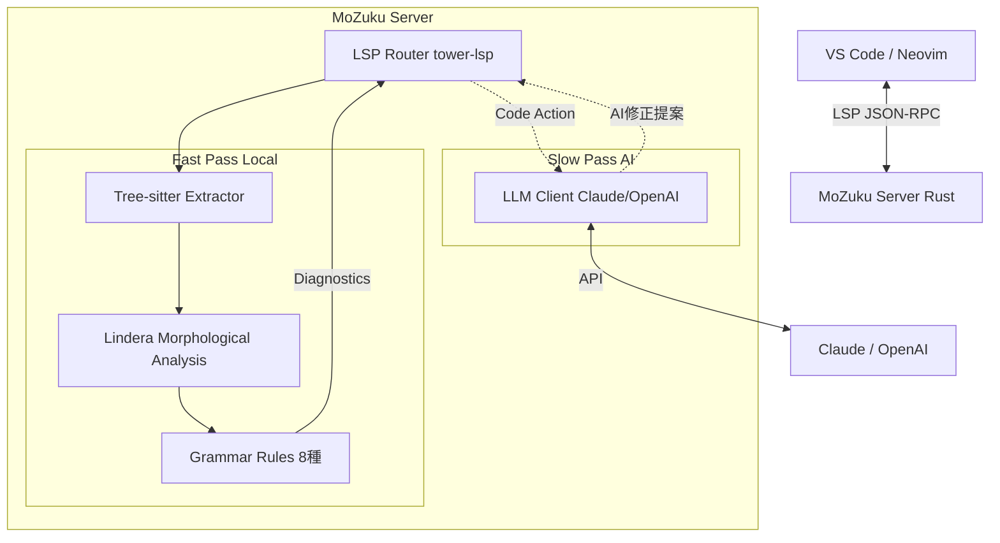

# MoZuku (Rust/LLM Fork)

**MoZuku** は、Rust言語により再実装され、大規模言語モデル（LLM）との連携機能を強化した、次世代の日本語校正Language Serverである。

本システムは、従来の形態素解析に基づく高速な検査機能に加え、LLMを「活用する」側面と、LLMの出力を「検証する」側面の双方向アプローチを採用している。これにより、プログラミングにおけるコメント記述、Markdown、HTMLドキュメントなど、多様なテキスト執筆環境に対して強力な支援を提供する。

## 🎯 プロジェクトの特徴

| 特徴 | 説明 |
|------|------|
| **ポータブル** | MeCab/CaboCha不要。シングルバイナリで動作 |
| **高速** | Linderaによるローカル形態素解析でリアルタイム校正 |
| **AI連携** | Claude/OpenAI APIによる高度な修正提案 |
| **多形式対応** | Markdown, Rust, Python, TypeScript, C/C++, Go のコメント |

## ✨ 実装済み機能

### 文法チェック（ローカル処理）

| ルール | 例 | 説明 |
|--------|-----|------|
| ら抜き言葉 | 食べれる → 食べられる | 可能動詞の誤用 |
| い抜き言葉 | 食べてる → 食べている | 進行形の省略 |
| 助詞の重複 | 私はは → 私は | 同一助詞の連続 |
| 二重敬語 | おっしゃられる → おっしゃる | 過剰な敬語表現 |
| 冗長表現 | することができる → できる | 不要な言い回し |
| 連続文末 | です。です。です。 | 同一文末の反復 |
| たり並列 | 歩いたり走る → 歩いたり走ったり | 不完全な並列 |
| の連続 | 私の友達の本の内容 | 助詞「の」の過剰使用 |

### LLM連携機能

- **Claude (Anthropic)** / **OpenAI** API対応
- **Code Action** による修正提案
  - Quick Fix: ルールベースの即座修正
  - AI修正: LLMによる高度な修正提案
- 環境変数またはTOMLファイルでの設定

### 対応ファイル形式

- **Markdown** (.md) - 全文解析
- **プレーンテキスト** (.txt) - 全文解析
- **プログラミング言語** - コメント部分のみ抽出
  - Rust, Python, TypeScript, JavaScript, C, C++, Go

## 🛠️ アーキテクチャ



## 📦 インストール

### 前提条件

- Rust ツールチェーン (cargo)

### ビルド手順

```bash
git clone https://github.com/clearclown/MoZukuRust.git
cd MoZukuRust/mozuku-rs
cargo build --release
```

生成バイナリ: `target/release/mozuku-rs`

### パスを通す（オプション）

```bash
# ユーザーディレクトリにコピー
mkdir -p ~/.mozuku/bin
cp target/release/mozuku-rs ~/.mozuku/bin/

# PATHに追加 (~/.bashrc or ~/.zshrc)
export PATH="$HOME/.mozuku/bin:$PATH"
```

## ⚙️ 設定

### 設定ファイル (mozuku.toml)

プロジェクトルートまたは `~/.config/mozuku/` に配置:

```toml
[llm]
# プロバイダー: "claude", "openai", "none"
provider = "claude"

# APIキー（環境変数でも可）
# api_key = "sk-..."

# モデル名（省略時はデフォルト）
# model = "claude-3-5-sonnet-20241022"

[checker]
ra_nuki = true              # ら抜き言葉
i_nuki = true               # い抜き言葉
double_particle = true      # 助詞重複
double_honorific = true     # 二重敬語
redundant_expression = true # 冗長表現
consecutive_endings = true  # 連続文末
tari_parallel = true        # たり並列
consecutive_no = true       # の連続
```

### 環境変数

```bash
# Claude API
export ANTHROPIC_API_KEY="your-api-key"

# OpenAI API
export OPENAI_API_KEY="your-api-key"
```

## 🔌 エディタ連携

### VS Code

1. `vscode-mozuku` 拡張機能をインストール
2. `mozuku-rs` が自動検出される（または `mozuku.serverPath` で指定）

```bash
cd vscode-mozuku
npm install
npm run compile
# F5でデバッグ実行
```

### Neovim (nvim-lspconfig)

```lua
require('lspconfig').mozuku.setup {
  cmd = { "/path/to/mozuku-rs" },
  filetypes = { "markdown", "text", "rust", "python", "typescript" },
}
```

### Helix

```toml
# ~/.config/helix/languages.toml
[[language]]
name = "markdown"
language-servers = ["mozuku"]

[language-server.mozuku]
command = "/path/to/mozuku-rs"
```

## 🤖 Claude Code との連携

MoZukuは、Claude Codeが生成する日本語テキストの品質検証に最適:

```bash
# 1. Claude Codeで日本語ドキュメントを生成
claude "このプロジェクトのREADMEを日本語で書いて"

# 2. エディタで開くと自動的にMoZukuが校正
#    - ら抜き言葉、二重敬語などを即座に検出
#    - Code Actionで修正提案を表示

# 3. LLM連携が有効なら、AIによる高度な修正も提案
```

## 🗺️ 開発状況

- [x] **Phase 1: Rust 基盤の確立**
  - tower-lsp による LSP サーバー
  - Lindera 形態素解析
  - セマンティックトークン、ホバー情報
- [x] **Phase 2: ドキュメント構造解析**
  - tree-sitter 統合
  - コメント/Markdown テキスト抽出
- [x] **Phase 3: ルールベース診断**
  - 8種の文法チェックルール
  - TDDによる60個のユニットテスト
- [x] **Phase 4: LLM 統合**
  - Claude/OpenAI API対応
  - Code Action による修正提案

### 今後の予定

- [ ] 係り受け解析（CaboCha相当）
- [ ] 文体統一チェック（です・ます / だ・である）
- [ ] LaTeX対応
- [ ] ローカルLLM (Ollama) 対応

## 🤝 貢献について

Pull Request は歓迎する。特に Rust による NLP 処理や、プロンプトエンジニアリングに関心のある開発者からの貢献を期待している。

## 📄 ライセンス

MIT License
