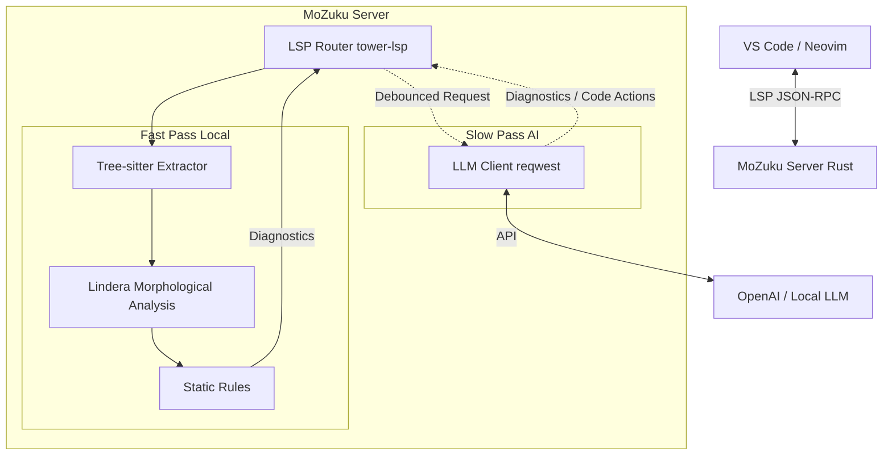

# MoZuku (Rust/LLM Fork)

**MoZuku** (JMozukuRust) は、Rust言語により再実装され、大規模言語モデル（LLM）との連携機能を強化した、次世代の日本語校正Language Serverである。

本システムは、従来の形態素解析に基づく高速な検査機能に加え、LLMを「活用する」側面と、LLMの出力を「検証する」側面の双方向アプローチを採用している。これにより、プログラミングにおけるコメント記述、Markdown、LaTeX、HTMLドキュメントなど、多様なテキスト執筆環境に対して強力な支援を提供する。

## 🚀 プロジェクトの理念

本プロジェクトは、C++版MoZukuからの派生プロジェクトであり、以下の課題解決を目的として発足した。

1. **システム依存性の排除**:
   C++版において必須要件であったMeCabやCaboChaのシステムインストールを不要とし、RustおよびLinderaを採用することで、ポータブルなシングルバイナリとしての提供を実現する。

2. **LLMによる相互補完**:
   - **LLMを用いた推敲**: 従来のルールベース手法では困難であった「文脈理解」や「トーン＆マナーの統一」を、LLMを活用することで実現する。
   - **LLM出力の校正**: Claude CodeやChatGPT等が生成する日本語テキストに含まれる「不自然な表現」や「文法上の誤り」を、高速なローカル解析によって検出・修正し、その品質を担保する。

3. **マルチフォーマット対応**:
   ソースコード内のコメントのみならず、学術論文（LaTeX）やWeb記事（HTML/Markdown）の執筆においても最適化された環境を提供する。

## ✨ 主要機能（開発予定を含む）

### 1. 高速なリアルタイム校正 (Fast Pass)

エディタでの入力中、あるいはLLMが生成したテキストに対し、ローカル処理にて即座にフィードバックを行う。

- **使用技術**: Rust + [Lindera](https://github.com/lindera-morphology/lindera) (Pure Rust 形態素解析器)
- **検出項目**:
  - ら抜き言葉 / い抜き言葉
  - 二重助詞（「がが」「をを」など）
  - 誤字脱字の検出
  - 品詞ごとのセマンティックハイライト

### 2. AIによる高度な推敲 (Slow Pass / Async)

ユーザーの入力停止時や保存時に、バックグラウンド処理にてLLMへの問い合わせを実施する。

- **使用技術**: OpenAI API / Anthropic API / Local LLM (Ollama) 連携
- **検出項目**:
  - 文体の統一（「です・ます」調と「だ・である」調の混在チェック）
  - 「より自然な日本語」への修正提案
  - 冗長な表現の指摘
  - 英語コメントの和訳、およびその逆変換

### 3. 多様なファイル形式への対応

[tree-sitter](https://tree-sitter.github.io/tree-sitter/) を活用し、ドキュメントの構造を解析した上で、「文章部分のみ」を抽出・解析する。

- **Markdown** / **Text**: 全文解析
- **LaTeX**: 数式やコマンドを除外した本文のみを解析
- **HTML**: タグを除外したコンテンツのみを解析
- **プログラミング言語**:
  - Rust, Python, TypeScript, C++, Go 等におけるコメント部分 (`//`, `/* ... */`)

## 🛠️ アーキテクチャ



## 📦 インストール

> ⚠️ 現在、本プロジェクトは開発の初期段階にある。

### 前提条件

- Rust ツールチェーン (cargo)

### ビルド手順

```bash
git clone https://github.com/clearclown/MoZukuRust.git
cd MoZukuRust
cargo build --release
```

### VS Code 拡張機能としての利用手順

1. `editors/vscode` ディレクトリへ移動する。
2. `npm install` および `npm run compile` を実行する。
3. デバッグ実行 (F5) を開始する。

## 🗺️ ロードマップ

- [ ] **Phase 1: Rust 基盤の確立**
  - tower-lsp を用いた LSP サーバーの構築
  - lindera 統合による形態素解析の実装
  - 基礎的な単語ハイライト機能の実装
- [ ] **Phase 2: ドキュメント構造解析**
  - tree-sitter の統合
  - コメント/Markdown/LaTeX からのテキスト抽出ロジックの移植
- [ ] **Phase 3: ルールベース診断の移植**
  - ら抜き言葉、二重助詞チェックの実装
- [ ] **Phase 4: LLM 統合**
  - 設定ファイル (`mozuku.toml`) による API キー管理
  - 非同期での LLM 問い合わせおよび Diagnostic 表示
  - Code Action による AI 修正の適用

## 🤝 貢献について

Pull Request は歓迎する。特に Rust による NLP 処理や、プロンプトエンジニアリングに関心のある開発者からの貢献を期待している。

## 📄 ライセンス

MIT License
